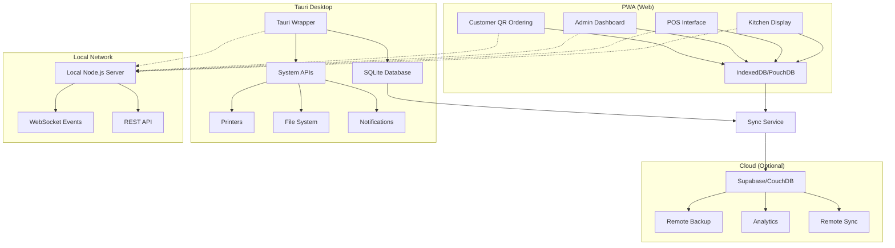

# OrderIN - Project Architecture Plan

## Overview
A local-first OrderIN management and QR-based food ordering system built with a PWA-first approach, wrapped in Tauri for desktop deployment. The system supports offline operation with optional cloud sync.

## Architecture Strategy: PWA → Tauri Wrapper

We're building a Progressive Web App (PWA) first, which will then be wrapped in Tauri for desktop deployment. This approach provides:
- Single codebase for web and desktop
- Native desktop capabilities via Tauri
- Offline-first capabilities
- Easy deployment and updates

## Technology Stack

### Frontend Core
- **Framework**: React 18 + Vite + TypeScript
- **Styling**: Tailwind CSS + shadcn/ui components
- **State Management**: Zustand (simpler for local store)
- **Forms**: React Hook Form + Zod validation
- **Routing**: React Router v6
- **Animations**: Framer Motion
- **PWA**: Workbox for offline caching

### Desktop Wrapper
- **Framework**: Tauri (Rust-based, lightweight)
- **Local Database**: SQLite via Tauri plugins
- **System Integration**: File system, printers, notifications

### Data & Sync
- **Browser Storage**: IndexedDB via PouchDB
- **Desktop Storage**: SQLite
- **Sync**: PouchDB ↔ CouchDB replication
- **Real-time**: WebSockets for local events

### Cloud (Optional)
- **Backend**: Supabase (Postgres + Auth + Realtime)
- **Payments**: Stripe + Razorpay connectors
- **Hosting**: Vercel (frontend) + Render (backend)

## Project Structure

```
orderin/
├── src/                          # React application source
│   ├── components/               # Reusable UI components
│   │   ├── ui/                   # shadcn/ui base components
│   │   ├── forms/                # Form components
│   │   └── layout/               # Layout components
│   ├── pages/                    # Page components
│   │   ├── admin/                # Admin dashboard
│   │   ├── pos/                  # Point of Sale
│   │   ├── kitchen/              # Kitchen Display System
│   │   ├── menu/                 # Menu management
│   │   ├── billing/              # Billing & invoices
│   │   ├── complaints/           # Complaint center
│   │   ├── settings/             # Settings
│   │   └── reports/              # Analytics & reports
│   ├── hooks/                    # Custom React hooks
│   ├── stores/                   # Zustand stores
│   ├── services/                 # API and business logic
│   │   ├── database/             # Database operations
│   │   ├── sync/                 # Sync logic
│   │   ├── print/                # Printing services
│   │   └── payments/             # Payment processing
│   ├── types/                    # TypeScript type definitions
│   ├── schemas/                  # Zod validation schemas
│   ├── utils/                    # Utility functions
│   ├── constants/                # App constants
│   └── assets/                   # Static assets
├── public/                       # Public assets
│   ├── icons/                    # PWA icons
│   └── manifest.json             # PWA manifest
├── src-tauri/                    # Tauri application source
│   ├── src/                      # Rust source code
│   │   ├── main.rs               # Tauri main entry
│   │   ├── commands/             # Tauri commands
│   │   ├── database/             # SQLite operations
│   │   └── printers/             # Printer integration
│   ├── Cargo.toml                # Rust dependencies
│   ├── tauri.conf.json           # Tauri configuration
│   └── build.rs                  # Build script
├── docs/                         # Documentation
├── tests/                        # Test files
├── package.json                  # Node.js dependencies
├── vite.config.ts               # Vite configuration
├── tailwind.config.js           # Tailwind configuration
├── tsconfig.json                # TypeScript configuration
└── README.md                    # Project documentation
```

## Data Models

### Core Entities

```typescript
// User & Authentication
interface User {
  id: string; // UUID
  username: string;
  role: 'admin' | 'staff' | 'kitchen';
  pin?: string; // For local auth
  createdAt: Date;
  updatedAt: Date;
}

// Menu Management
interface MenuItem {
  id: string; // UUID
  name: string;
  description?: string;
  price: number;
  category: string;
  imageUrl?: string;
  isAvailable: boolean;
  modifiers?: MenuItemModifier[];
  createdAt: Date;
  updatedAt: Date;
}

interface MenuItemModifier {
  id: string;
  name: string;
  options: ModifierOption[];
  required: boolean;
  multiSelect: boolean;
}

interface ModifierOption {
  id: string;
  name: string;
  price: number;
}

// Order Management
interface Order {
  id: string; // UUID
  tableNumber?: number;
  orderType: 'dine-in' | 'takeaway' | 'delivery';
  status: 'pending' | 'confirmed' | 'preparing' | 'ready' | 'completed' | 'cancelled';
  items: OrderItem[];
  subtotal: number;
  tax: number;
  total: number;
  paymentStatus: 'pending' | 'paid' | 'refunded';
  paymentMethod?: 'cash' | 'card' | 'upi' | 'online';
  customerInfo?: CustomerInfo;
  createdAt: Date;
  updatedAt: Date;
}

interface OrderItem {
  id: string;
  menuItemId: string;
  quantity: number;
  price: number;
  modifiers?: SelectedModifier[];
  notes?: string;
}

interface SelectedModifier {
  modifierId: string;
  optionIds: string[];
}

// Tables
interface Table {
  id: string; // UUID
  number: number;
  capacity: number;
  status: 'available' | 'occupied' | 'reserved' | 'cleaning';
  currentOrderId?: string;
  qrCodeUrl: string;
  createdAt: Date;
  updatedAt: Date;
}

// Complaints
interface Complaint {
  id: string; // UUID
  orderId?: string;
  customerName?: string;
  customerContact?: string;
  category: 'food' | 'service' | 'ambiance' | 'payment' | 'other';
  description: string;
  severity: 'low' | 'medium' | 'high';
  status: 'open' | 'investigating' | 'resolved' | 'closed';
  resolution?: string;
  createdAt: Date;
  updatedAt: Date;
}

// Settings
interface CafeSettings {
  id: string; // UUID
  cafeName: string;
  address?: string;
  phone?: string;
  email?: string;
  taxRate: number;
  currency: string;
  paymentModes: {
    payBefore: boolean;
    payAfter: boolean;
    onlinePayments: boolean;
  };
  printing: {
    enabled: boolean;
    printerName?: string;
    autoPrintOrders: boolean;
    autoPrintBills: boolean;
  };
  cloudSync: {
    enabled: boolean;
    endpoint?: string;
    lastSync?: Date;
  };
  createdAt: Date;
  updatedAt: Date;
}
```

## System Architecture Flow



## Development Phases

### Phase 1: Foundation (Week 1-2)
1. Project setup with Vite + React + TypeScript
2. Tauri configuration and basic wrapper
3. Design system setup (Tailwind + shadcn/ui)
4. Data models and Zod schemas
5. Basic routing and layout structure

### Phase 2: Core Features (Week 3-5)
1. Authentication and role management
2. Local database implementation (SQLite + PouchDB)
3. Menu Management CRUD operations
4. Basic POS interface
5. Kitchen Display System

### Phase 3: Customer Experience (Week 6-7)
1. Customer QR Ordering PWA
2. Table management and QR generation
3. Order status tracking
4. Real-time updates via WebSockets

### Phase 4: Business Operations (Week 8-9)
1. Billing and invoice generation
2. Complaint management system
3. Settings and configuration
4. Basic reports and analytics

### Phase 5: Advanced Features (Week 10-12)
1. Local printing integration
2. Payment processing (Stripe/Razorpay)
3. Offline-first sync mechanism
4. Cloud sync toggle and implementation

### Phase 6: Polish & Testing (Week 13-14)
1. Comprehensive testing suite
2. Performance optimization
3. PWA features (offline caching, installable)
4. Documentation and deployment guides

## Key Technical Decisions

### 1. PWA-First Approach
- Single codebase for web and desktop
- Progressive enhancement for desktop features
- Easier maintenance and updates

### 2. Local-First Data Strategy
- SQLite for desktop (robust, performant)
- IndexedDB/PouchDB for web (sync-ready)
- Client-side UUID generation for idempotency
- Conflict resolution with Last-Write-Wins

### 3. Modular Architecture
- Feature-based folder structure
- Clear separation of concerns
- Reusable components and services
- Type-safe development throughout

### 4. Offline-First Design
- Service worker for caching
- Local data persistence
- Sync queue for offline operations
- Graceful degradation without internet

### 5. Progressive Enhancement
- Core functionality works offline
- Enhanced features with connectivity
- Optional cloud sync for backup/analytics
- Flexible payment modes

## Next Steps

1. Set up the development environment
2. Initialize the project structure
3. Configure Tauri and PWA settings
4. Implement the design system
5. Create the data layer with schemas
6. Build the authentication system
7. Develop core modules incrementally

This architecture provides a solid foundation for a scalable, maintainable OrderIN management system that can work entirely offline while offering optional cloud capabilities.